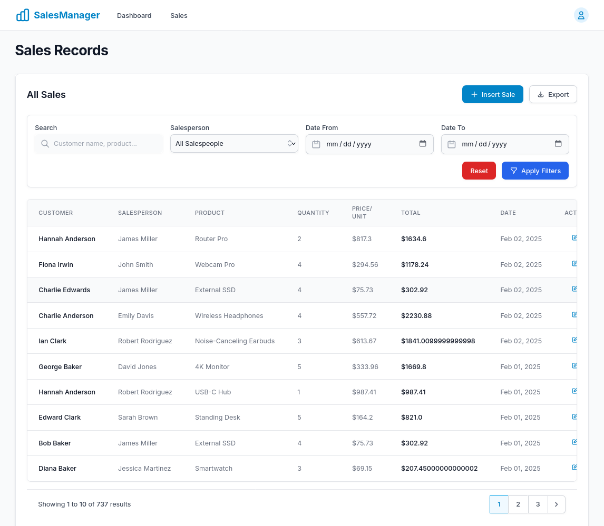
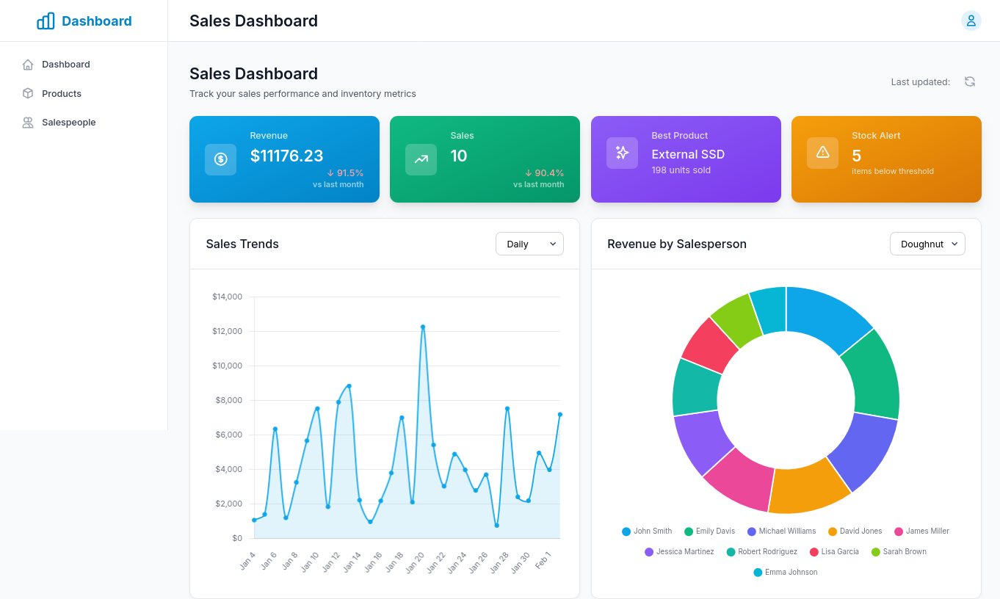

# Sales Dashboard

A real-time sales dashboard application built with Django, Channels, and PostgreSQL. The application includes WebSocket support for real-time updates and comes with a demo dataset.

## Screenshots

### Sales Management Interface



### Real-time Dashboard



## Live Demo (Without Real-time Features)

You can check out the live demo at: [https://assigntaskpro.pythonanywhere.com/](https://assigntaskpro.pythonanywhere.com/)

**Note:** The live demo on PythonAnywhere doesn't support real-time features. To experience the full real-time functionality, please install the Docker container locally using the instructions below.

## Prerequisites

Before you begin, ensure you have the following installed on your system:

- Docker ([Install Docker](https://docs.docker.com/get-docker/))
- Docker Compose ([Install Docker Compose](https://docs.docker.com/compose/install/))

## Quick Start

1. Clone the repository:

```bash
git clone https://github.com/babuljackdev/sales_dashboard.git
cd sales_dashboard
```

2. Start the application using Docker Compose:

```bash
docker-compose up -d
```

The application will be available at: http://localhost:8000

## What's Included

The Docker setup includes:

- Django web application with Daphne ASGI server
- PostgreSQL database
- Redis for WebSocket support
- Sample data generation

### Sample Data

The application comes with pre-configured sample data:

- 30 products with random prices and stock levels
- 10 salespeople with unique contact information
- Historical sales data for the past 7 months

## Docker Commands

Here are some useful Docker commands for managing the application:

1. Start the application:

```bash
docker-compose up -d
```

2. Stop the application:

```bash
docker-compose down
```

3. View logs:

```bash
docker-compose logs -f
```

4. Rebuild containers (after making changes):

```bash
docker-compose up --build -d
```

5. View running containers:

```bash
docker-compose ps
```

## Configuration

The application uses the following default configuration:

### Web Application

- Port: 8000
- URL: http://localhost:8000

### PostgreSQL Database

- Host: db
- Port: 5432
- Database: sales_db
- Username: sales_user
- Password: sales_password

### Redis

- Host: redis
- Port: 6379

## Troubleshooting

1. If the containers don't start:

   ```bash
   # Check if ports are in use
   sudo lsof -i :8000
   sudo lsof -i :5432
   sudo lsof -i :6379

   # Stop local services if needed
   sudo service postgresql stop
   sudo service redis-server stop
   ```
2. If you can't connect to the database:

   ```bash
   # Check database logs
   docker-compose logs db

   # Check if database is ready
   docker-compose exec db pg_isready
   ```
3. If the application shows no data:

   ```bash
   # Check web application logs
   docker-compose logs web

   # Manually trigger data generation
   docker-compose exec web python manage.py generate_testdata
   ```

## Development

To make changes to the application:

1. Modify the code as needed
2. Rebuild the containers:

```bash
docker-compose up --build -d
```

## Project Structure

```
.
├── Dockerfile              # Docker configuration for web application
├── docker-compose.yml      # Docker Compose configuration
├── requirements.txt        # Python dependencies
├── entrypoint.sh          # Docker entrypoint script
├── manage.py              # Django management script
├── sales/                 # Sales application
├── dashboard/             # Dashboard application
└── sales_dashboard/       # Project settings
```

## Features

- Real-time sales dashboard with WebSocket updates
- Product management
- Sales tracking
- Salesperson management
- Historical sales data visualization
- Responsive design
- Demo data generation

## Security Notes

For production deployment:

1. Change default database credentials in `docker-compose.yml`
2. Set secure `SECRET_KEY` in Django settings
3. Set `DEBUG=False` in production
4. Configure proper SSL/TLS
5. Update `ALLOWED_HOSTS` in Django settings

## Contributing

1. Fork the repository
2. Create your feature branch
3. Commit your changes
4. Push to the branch
5. Create a Pull Request
